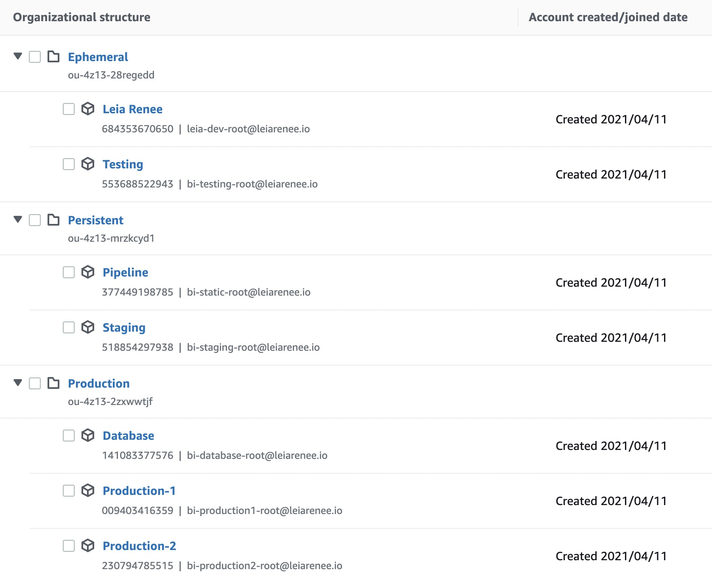
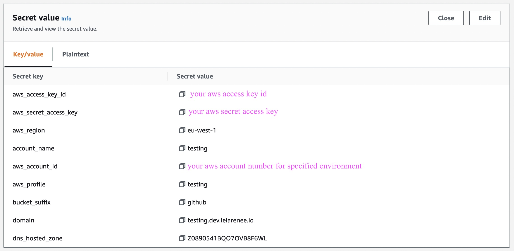
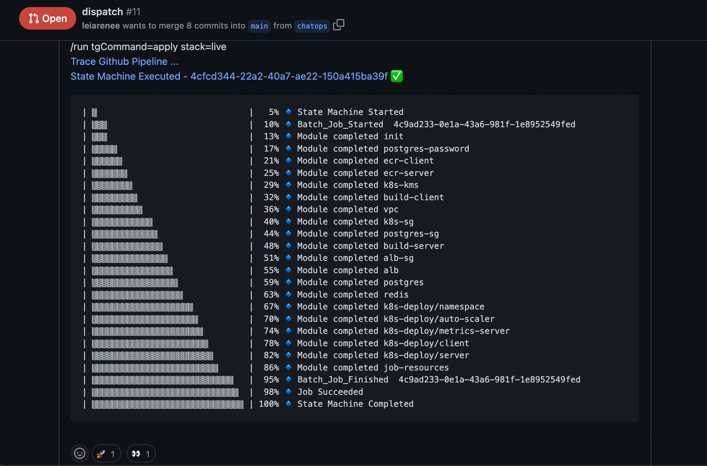
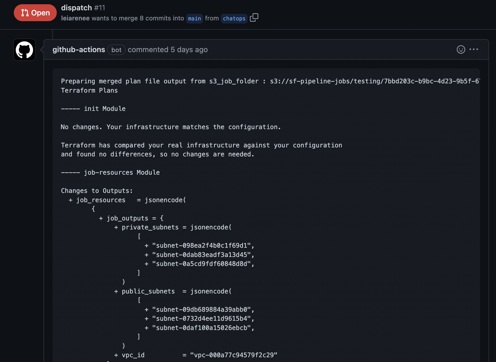

# SF-Pipeline

## Description

Continious deployment via GitOps approach using AWS Step-functions along with AWS Batch on Fargate to enqueue and orchestrate on-demand terraform/terragrunt jobs. 

## Chatops Commands supported 

```bash
/run 
 <tgCommand=[apply|plan|destroy|validate|output|show> 
 <stack=[live|test|light|...]> 
 <targetAwsRegion=[eu-west-1|...]> 
 <workspaceId=[testing|staging|production-1|production-2|pipeline|database]>
```

Note: All parameters should be in one line.

### Project Links

* [Architecture, System Design and Flow Diagrams](./docs/architecture/README.md)
* [Project Board](https://github.com/users/leiarenee/projects/1)
* [Road Map](https://github.com/leiarenee/sf-pipeline/milestones?direction=asc&sort=due_date)

### Repositories

* [Pipeline Repository](https://github.com/leiarenee/sf-pipeline)
* [Infrastructure Repository](https://github.com/leiarenee/sf-infra)
* [Application Repository](https://github.com/leiarenee/sf-app)

## Requirements

- [terraform](https://learn.hashicorp.com/tutorials/terraform/install-cli)
- [terragrunt](https://terragrunt.gruntwork.io/docs/getting-started/install/)
- [aws-cli](https://docs.aws.amazon.com/cli/latest/userguide/getting-started-install.html)
- [jq](https://stedolan.github.io/jq/download/)
- [python 3.9](https://www.python.org/downloads/)
- [direnv](https://direnv.net/docs/installation.html)
- [envsubst](https://www.gnu.org/software/gettext/manual/html_node/envsubst-Invocation.html)
- [rdfind](https://rdfind.pauldreik.se/)
- [uuidgen](https://man7.org/linux/man-pages/man1/uuidgen.1.html)

## Installation

### Prepare your organizational structure

You don't need to have all accounts. Only two accounts, `pipeline and testing` are required to test the pipeline. You can customize organizational units, rename them or re-structure for your requirements. On the other hand you'd better put ephemeral accounts under same organizational parent since you will nuke them every night in a crone job.

### Sample Organization structure



### Fork Repositories

Fork [sf-pipeline](https://github.com/leiarenee/sf-pipeline) repository along with [sf-infra](https://github.com/leiarenee/sf-infra) and [sf-app](https://github.com/leiarenee/sf-app) repositories and clone your forks  within the same directory in your local environment.

```tree
- parent-dir
  - sf-pipeline
  - sf-infra
  - sf-app
```

### Install Pipelime infrastructure

* Change directory to `sf-pipeline/infra/pipeline/live/all/terraform`
* Dublicate  `sample-custom-inputs.auto.tfvars.json` and rename it as `custom-inputs.auto.tfvars.json` 
```json
{
  "pipeline_account": "<your-pipeline-account>"
}
```
* Run
```hcl
terraform apply
```

### Github Secrets

* In your sf-pipeline fork enter following secrets under settings/secrets/actions
  * AWS_SECRET_ACCESS_KEY (for an Iam user having admin rights for your your pipeline account)
  * AWS_SECRET_ACCESS_KEY (Same as above)
  * AWS_REGION (Same as above)
  * PAT_WORKFLOW (Private access token which has minimum access rights executing workflow)

Note: In `sf-infra` and `sf-app` only PAT_WORKFLOW is required

### AWS Secrets manager

* In AWS Secrets manager create floowing secrets for every environment you would like to have. Save the secret names as following
  * PIPELINE_AWS_ACCESS (Required)
  * TESTING_AWS_ACCESS (Required)
  * STAGING_AWS_ACCESS (Optional)
  * PRODUCTION1_AWS_ACCESS (Optional)
  * PRODUCTION2_AWS_ACCESS (Optional)
  * DATABASE_AWS_ACCESS (Optional)



## Prapare local environment (Not necessary if you don't want to test locally)

Homebrew:
```sh
brew install terraform terragrunt awscli jq python@3.9 direnv gettext rdfind
```

<details>
<summary> Other</summary>

### Linux (and WSL)
```sh
# jq, direnv and python are available in standard package libraries
sudo apt-get install jq direnv python3 aws-cli gettext uuid-runtime

# For terraform you can either add the hashicorp repo:
curl -fsSL https://apt.releases.hashicorp.com/gpg | sudo apt-key add -
sudo apt-add-repository "deb [arch=amd64] https://apt.releases.hashicorp.com $(lsb_release -cs) main"
sudo apt-get update && sudo apt-get install terraform

#..or manually download the binary and place it somewhere (similar to process below)


# For terragrunt you need to manually download it to an appropriate folder and set as executable
# https://terragrunt.gruntwork.io/docs/getting-started/install/#download-from-releases-page
pushd /tmp/
wget https://github.com/gruntwork-io/terragrunt/releases/download/v0.36.3/terragrunt_linux_amd64
mv terragrunt_linux_amd64 ~/.local/bin/terragrunt # move to a folder that's in our $PATH
chmod +x ~/.local/bin/terragrunt # Make executable
popd
```

### Debugging installation problems

### `envsubst : command not found` 

You'll need to install `envsubst`. For Debian-like systems it is part ofthe `gettext-base` package
```sh
apt-get install gettext-base
```

</details>

<br>

## Test

In the sf-infra create a test branch, open a PR and enter following as a new comment.
```
/run tgCommand=apply stack=light
```

Other stacks available are test with no real infrastructure and live with a real sample kubernetes cluster with postgres RDS and othe components.

## Example Runs
### Apply

```
/run tgCommand=apply stack=live
```




### Plan
```
/run tgCommand=plan stack=light
```



